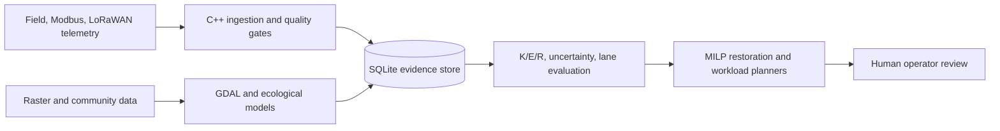

<!-- File: docs/README.md -->
# Eco-Restoration C++ System

## Architecture

The system is non-actuating: telemetry, models, and planners produce evidence, risk coordinates, and operator-review decisions.

## Data flow

1. `cpp/tools/` ingests bounded, validated telemetry into SQLite.
2. `cpp/eco_restoration/` computes soil, water, heat, biodiversity, carbon, community, and K/E/R coordinates.
3. `cpp/simulation/` evaluates scenarios, uncertainty, sensitivity, optimization, and forecasts.
4. `lua/eco_restoration/` provides constrained routing, preprocessing, and review adapters.
5. `sql/eco_restoration/` defines strict tables, views, indexes, and quality checks.

## Key contracts

- Scores are normalized to `[0,1]`.
- SQLite inputs use prepared statements and strict schemas.
- Hex anchors use the established packed 4-bit level, 30-bit row, and 30-bit column representation.
- Inputs carrying uncertainty must preserve both estimated value and calibration confidence.
