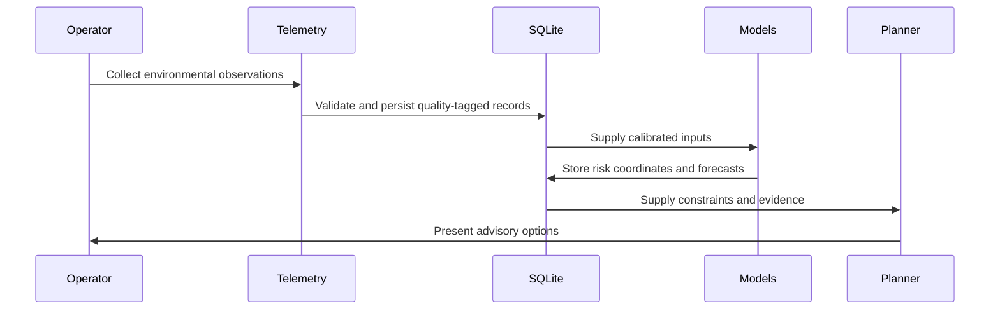

<!-- File: docs/getting-started.md -->
# Getting Started

## Build

```sh
cmake -S . -B build -DCMAKE_BUILD_TYPE=Release -DBUILD_TESTING=ON
cmake --build build --parallel
ctest --test-dir build --output-on-failure
```

Run repository validation when available:

```sh
pwsh -File scripts/launch.ps1 -RepoRoot . -Configure -Build -Test -Lint -ValidateLua -ValidateSql
```

## Typical workflow



1. Load SQL schemas from `sql/eco_restoration/`.
2. Ingest telemetry with the HTTP, Unix-socket, Modbus, or LoRaWAN adapters.
3. Run relevant GDAL, hydrology, soil-carbon, and biodiversity modules.
4. Evaluate `uncertainty_aware_lane_decision` before workload or restoration planning.
5. Review Pareto, scenario, and conflict outputs before recording any operator choice.
