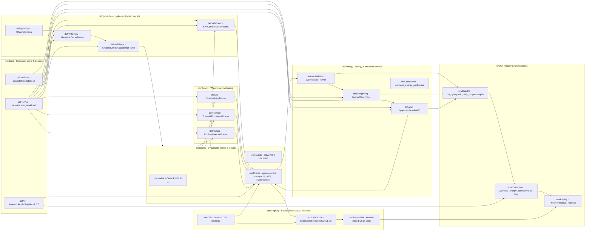

# Cyboquatic Routing, Energy, and Hydraulics Map

The diagram below outlines how non-actuating routing frames, energy mechanics, hydraulics, and ecosafety policies interact around `db_cyboquatic_daily_progress.sqlite` and related shards. It is designed as a quick orientation surface for coding-agents, AI-chat platforms, and collaborators.

### Reading the diagram

- Hydraulic frames (`defHyd*`) consume inflows and channel properties, compute decay and merges, and update node-bound shards with hydraulic risk and SAT performance, never actuating hardware.
- Energy frames (`defLoadDeltaVt`, `defEnergyReq`, `defLyap`, `defContractive`) map workload ΔVt into `energyreqJ` and Lyapunov residual `Vt`, stored in `db_cyboquatic_daily_progress.sqlite`, and surface a `workload_energy_contractive_ok` flag for CI.
- Quality and fouling frames (`defMix`, `defThermal`, `defFouling`) propagate water-quality, thermal, and fouling metrics into shards so agents can see how hydraulics and chemistry couple into risk coordinates.
- Policies (`polCorridors`, `polKer`, `polNonAct`) define corridors, deployment gates, and non-actuating invariants that all frames must obey, keeping ecosafety grammar frozen and non-weaponizable.
- Envelopes and anchors (`envCI`, `ancRegistry`) tie daily progress rows, ecoscore ALN particles, and EcoNet index entries together via DIDs, so AI-chat and coding-agents can safely traverse functions, data, and governance paths.
