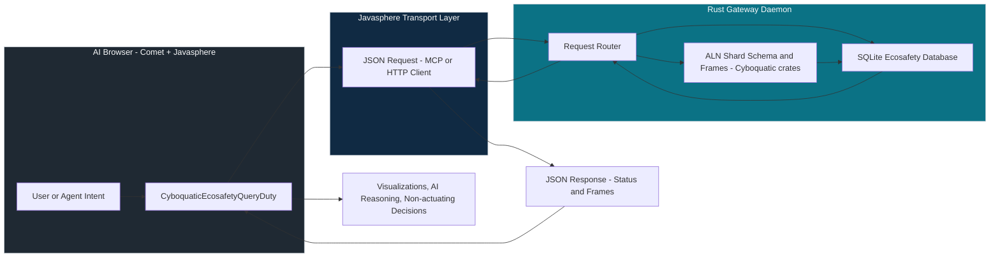

# CyboquaticEcosafetyQueryDuty

`CyboquaticEcosafetyQueryDuty` is the Javasphere browser-duty facade for querying cyboquatic ecosafety data and risk frames from an ALN‑backed Rust/SQLite gateway.

It exposes a small, stable set of request/response contracts that AI browsers (e.g., Comet) and agents can safely call without touching actuation stacks.

---

## 1. Module Overview

- JavaScript entrypoint: `src/browser/duties/cyboquatic-ecosafety-query-duty.js`
- Primary class: `CyboquaticEcosafetyQueryDuty`
- Transport abstraction: `async (request) => response`
  - Can be bound to:
    - MCP tool call,
    - HTTP/JSON endpoint,
    - Local bridge into a Rust daemon.

The duty is **non‑actuating**: it only reads and refines ecosafety state via ALN‑governed Rust crates and SQLite shards.

---

## 2. Transport Contract

The duty never assumes a concrete transport; you inject one at construction:

```js
import {
  CyboquaticEcosafetyQueryDuty
} from "../src/browser/duties/cyboquatic-ecosafety-query-duty.js";

const duty = new CyboquaticEcosafetyQueryDuty(async (request) => {
  // Example: send JSON over MCP or HTTP and return parsed JSON response.
  const res = await myGatewayClient.send(request);
  return res;
});
```

- **Input**: a pure JSON object (one of the `*Request` shapes described below).
- **Output**: a JSON object conforming to the corresponding `*Response` shape.
- **Responsibility**: the transport MUST NOT add actuation commands; it only forwards queries to the Rust/SQLite/ALN gateway and returns results.

---

## 3. Request / Response Shapes

### 3.1 ShardSchemaQuery

#### Method

```js
duty.getShardSchema(familyId?);
duty.validateShardUpdate(familyId, shardUpdate);
```

#### Request: `ShardSchemaRequest`

```ts
type ShardSchemaRequest = {
  type: "ShardSchemaRequest";
  familyId: string; // e.g. "CyboquaticEcosafetyEnvelopePhoenix2026v1"
  expect: {
    fields: true;
    tags: true;
    riskAxes: boolean;
    allowedFrames: string[];
  };
};
```

- `familyId`: ALN shard family (envelope) identifier.
- `expect.riskAxes`: whether backend should include risk‑axis metadata.
- `expect.allowedFrames`: list of risk frames this shard supports
  (e.g. `"BiodiversityIntegrityFrame"`, `"MesocosmRiskFrame"`, `"LyapunovStabilityFrame"`).

#### Response: `ShardSchemaResponse`

```ts
type ShardSchemaFieldKind =
  | "String"
  | "Float"
  | "Bool"
  | "Enum"
  | "Hex64Evidence"
  | "Hex64Signature"
  | "RiskCoord01"
  | "TrustScalar01";

type ShardSchemaField = {
  name: string;
  kind: ShardSchemaFieldKind;
  mandatory: boolean;
  tags: string[];
};

type ShardSchemaResponse = {
  familyId: string;
  fields: ShardSchemaField[];
  riskAxes?: string[];
  allowedFrames?: string[];
};
```

---

#### Request: `ShardUpdateValidationRequest`

```ts
type ShardUpdateValidationRequest = {
  type: "ShardUpdateValidationRequest";
  familyId: string;
  payload: {
    familyId: string;
    values: Record<string, string>;
  };
};
```

- `payload.values`: field‑name → string value as proposed by the browser/agent; backend converts and validates against ALN schema and Rust `ShardSchema`.

#### Response: `ShardUpdateValidationResponse`

```ts
type ShardUpdateValidationErrorKind =
  | "FamilyMismatch"
  | "MissingField"
  | "UnexpectedField"
  | "TypeError"
  | "TagViolation";

type ShardUpdateValidationError = {
  kind: ShardUpdateValidationErrorKind;
  field?: string;
  reason?: string;
};

type ShardUpdateValidationResponse = {
  ok: boolean;
  errors: ShardUpdateValidationError[];
};
```

- `ok: true` → safe to insert/update in SQLite.
- `ok: false` → browser/agent must not persist; errors explain why.

---

### 3.2 WindowManagerQuery

#### Method

```js
duty.getNodeWindows(nodeId, {
  mode?: "fixed" | "sliding",
  windowSize?: number,   // hours
  windowStride?: number  // hours
});
```

#### Request: `NodeWindowRequest`

```ts
type NodeWindowMode = "fixed" | "sliding";

type NodeWindowRequest = {
  type: "NodeWindowRequest";
  nodeId: string;
  mode: NodeWindowMode;
  windowSize: number;
  windowStride: number;
  metrics: string[]; // e.g. ["r_overall", "r_biodiv", "vt_lyap"]
};
```

#### Response: `NodeWindowResponse`

```ts
type NodeRiskSample = {
  ts: string; // ISO-8601 timestamp
  metrics: Record<string, number>;
};

type NodeWindow = {
  windowId: string;
  nodeId: string;
  startTs: string;
  endTs: string;
  samples: NodeRiskSample[];
};

type NodeWindowResponse = {
  nodeId: string;
  mode: NodeWindowMode;
  windows: NodeWindow[];
};
```

- Backend is responsible for buffering `NodeRiskSample` rows and emitting windows.

---

### 3.3 EcosafetyStatusHistoryQuery

#### Method

```js
duty.getStatusHistory(nodeId, {
  historyDepth?: number // hours
});
```

#### Request: `EcosafetyStatusHistoryRequest`

```ts
type EcosafetyStatusHistoryRequest = {
  type: "EcosafetyStatusHistoryRequest";
  nodeId: string;
  historyDepth: number; // hours of history to return
};
```

#### Response: `EcosafetyStatusHistoryResponse`

```ts
type EcosafetyStatusLevel = "GREEN" | "WARN" | "RED";
type EcosafetyTrendTag = "improving" | "stable" | "degrading";

type EcosafetyStatusPoint = {
  ts: string;
  level: EcosafetyStatusLevel;
};

type EcosafetyStatusHistoryResponse = {
  nodeId: string;
  points: EcosafetyStatusPoint[]; // ring buffer, oldest → newest
  trend: EcosafetyTrendTag;
};
```

- Trend is computed from recent GREEN/WARN/RED transitions in the Rust layer.

---

### 3.4 BiodiversityIntegrityFrameQuery

#### Method

```js
duty.getBiodiversityFrame(nodeId, {
  windowSize?: number // hours
});
```

#### Request: `RiskFrameRequest` (BiodiversityIntegrityFrame)

```ts
type BiodiversityIntegrityFrameRequest = {
  type: "RiskFrameRequest";
  frame: "BiodiversityIntegrityFrame";
  nodeId: string;
  windowSize: number;
  inputs: [
    "r_biodiv_raw",
    "r_pfas",
    "r_cec",
    "r_trap_fish",
    "r_trap_amphib"
  ];
  outputMetric: "r_biodiv";
};
```

#### Response: `RiskFrameResponse` (BiodiversityIntegrityFrame)

```ts
type BiodiversityIntegrityFrameResponse = {
  frame: "BiodiversityIntegrityFrame";
  nodeId: string;
  windowSize: number;
  inputAverages: Record<string, number>;
  r_biodiv: number; // refined biodiversity risk 0..1
};
```

- Backend implements the actual function of PFAS, CEC, and trap‑risks; Javasphere only carries the contract.

---

### 3.5 MesocosmRiskFrameQuery

#### Method

```js
duty.getMesocosmFrame(nodeId, {
  mesocosmFamilyId?: string,
  lookaheadHours?: number
});
```

#### Request: `RiskFrameRequest` (MesocosmRiskFrame)

```ts
type MesocosmRiskFrameRequest = {
  type: "RiskFrameRequest";
  frame: "MesocosmRiskFrame";
  nodeId: string;
  mesocosmFamilyId: string; // e.g. "CyboquaticMesocosm2027v1"
  lookaheadHours: number;
  inputs: ["r_invasive_raw", "mesocosm_risk_index"];
  outputMetric: "r_invasive";
};
```

#### Response: `RiskFrameResponse` (MesocosmRiskFrame)

```ts
type MesocosmRiskFrameResponse = {
  frame: "MesocosmRiskFrame";
  nodeId: string;
  lookaheadHours: number;
  r_invasive_baseline: number;
  r_invasive_projected: number;
  corridor_widened: false;
};
```

- `corridor_widened` is explicitly `false` to document the invariant that mesocosm learning must not widen ecosafety corridors.

---

### 3.6 LyapunovStabilityFrameQuery

#### Method

```js
duty.getLyapunovFrame(nodeId, {
  historyDepth?: number // hours
});
```

#### Request: `RiskFrameRequest` (LyapunovStabilityFrame)

```ts
type LyapunovStabilityFrameRequest = {
  type: "RiskFrameRequest";
  frame: "LyapunovStabilityFrame";
  nodeId: string;
  historyDepth: number;
  inputs: ["vt_history"];
  outputs: [
    "lyapunov_exponent",
    "change_point_score",
    "pre_failure_flag"
  ];
};
```

#### Response: `RiskFrameResponse` (LyapunovStabilityFrame)

```ts
type LyapunovStabilityFrameResponse = {
  frame: "LyapunovStabilityFrame";
  nodeId: string;
  historyDepth: number;
  lyapunov_exponent: number;
  change_point_score: number;
  pre_failure_flag: boolean;
};
```

- Backend operates purely on Vt histories to detect pre‑failure regimes before ecosafety thresholds are crossed.

---

## 4. Typical Integration Flow

A Comet‑style AI browser agent would:

1. Construct a `CyboquaticEcosafetyQueryDuty` with a transport bound to an MCP tool or HTTP endpoint.
2. Ask for shard schema and validation before rendering any editing UI.
3. Request node windows and status history to render dashboards and trend indicators.
4. Call risk frames for fine‑grained insights (biodiversity, mesocosm, Lyapunov) without issuing any actuation commands.

All responses are safe for browser‑side visualization and reasoning; actuation remains in separate, certified stacks.

---

## 5. End‑to‑End Data Flow (Mermaid)



- The browser only ever sees JSON responses from the gateway and never touches actuator fields.
- The Rust gateway enforces ALN invariants and schema‑driven validation before any SQLite mutation.
- Risk frames are computed in Rust/ALN and returned as read‑only metrics for Javasphere and Comet to use.

---
